# Break-Point
编码不能没调试，调试不能没断点（Break Point），只会左键断点？是时候试试这样那样断点

基本断点

如下图，这种是最常用的断点，也是最容易设置。左键点击一下就可以设置。 

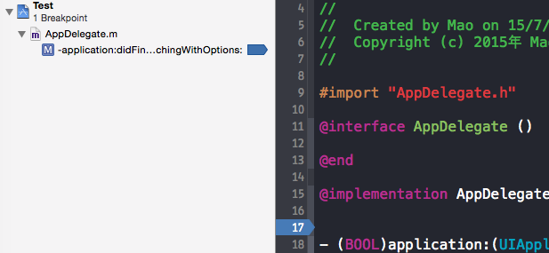

编辑断点

断点是可以编辑的。

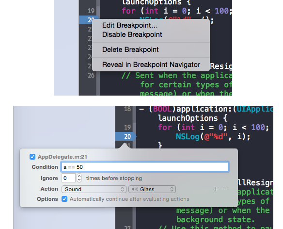

断点有下面几个属性可以设置：

Condition
Ignore
Action
Options
Condition

这里可以输入条件表达式，满足条件的时候断点就会生效。例如上面输入a == 50。这个是非常有用的设置，特别在循环体内调试的时候，用着真的是爽。

Ingore

在这里可以设置忽略断点次数。

Action

Action是这里最复杂的，最强大的功能了。Action有6中类型。如下图

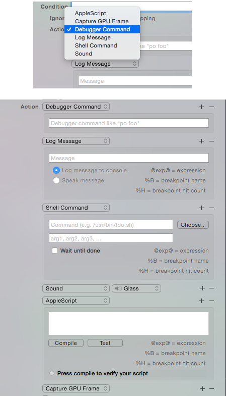
AppleScript
Capture GPU Frame
Debugger Command
Log Message
Shell Command
Sound
常用的就是Log Message和Debugger Command
Log Message

在这里填写的东西可以打印到控制台。例如我做了如下设置：
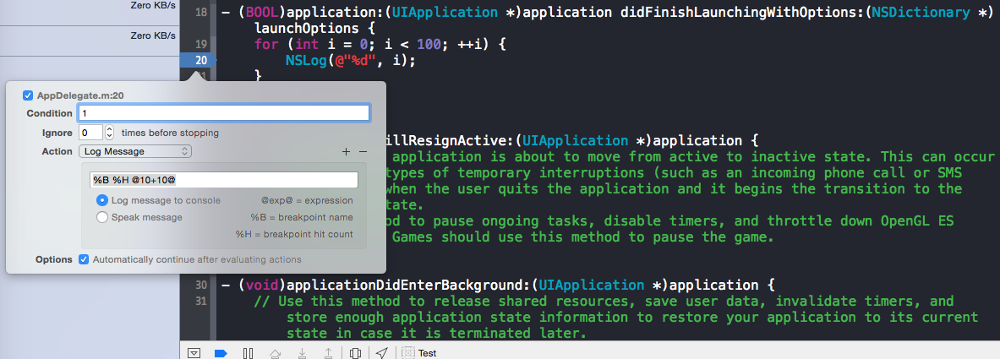
%B会打印断点的名字，%H会打印断点的调用次数，@@中间可以输入表达式。 上面的设置在控制台的输出如下：
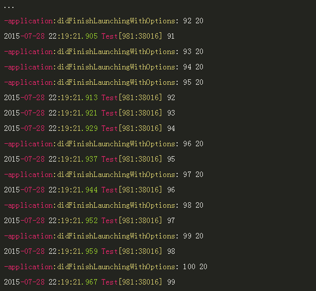

Debugger Command

这里可以输入调试命令，也就是po（打印对象信息），bt（打印函数栈），expression（表达式）这些调试命令。看图就明白了：
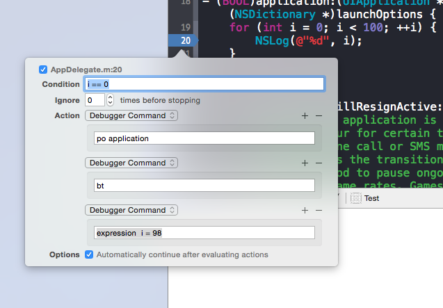

image 控制台输出如下：

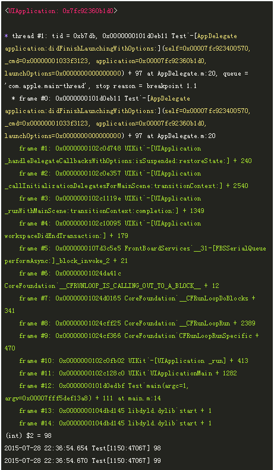

Options

勾选Automatically continue after evaluating actions之后程序会在断点产生后继续运行。这个属性是相当有用的，可以输入调试信息至于不暂停程序。

出了上面的基本断点外，XCode还提供了下面四种断点，需要点击断点面板左下角的+号添加。
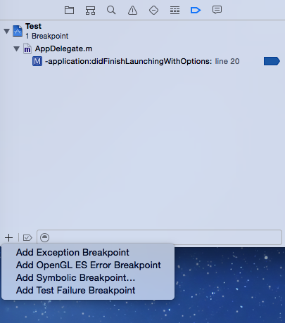
Exception Breakpoint
OpenGL ES Error Breakpoint
Symbolic Breakpoint
Test Failure Breakpoint
Exception Breakpoint

Exception Breakpoint是一个非常有用的断点项。正如名字所示，当程序抛出异常的时候就回产生断点。通常程序崩溃会停在崩溃的地方，但有时候并不能准确停在引起异常的地方。比如数组越界！比如我下图所示，会引起数组越界访问。 

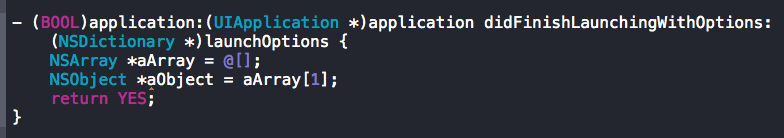
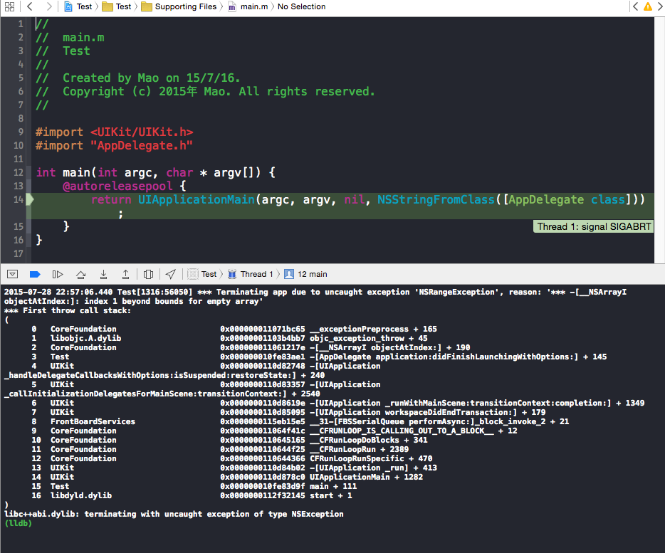
程序运行的时候就会崩溃。但是崩溃停在了main函数里面，就算看了栈信息也不能马上定位到到底是那个数组越界访问了。为什么崩溃不能停在数组越界哪里？这是因为数组越界访问不一定会导致程序崩溃的，数组越界访问会导致异常抛出，而抛出的异常没有得到处理才会导致程序崩溃。因此最后会导致崩溃停在CoreFoundation框架里面。这个时候就需要设置Exception Breakpoint产生断点来定位错误了。
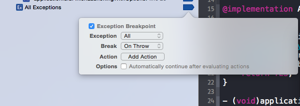
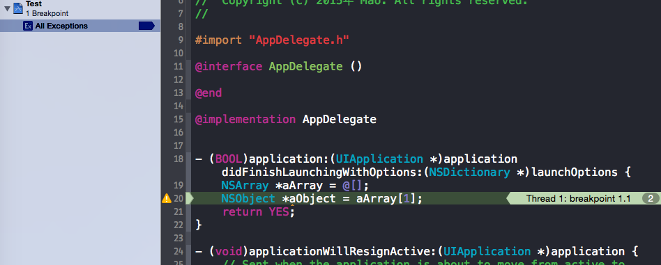
OpenGL ES Error Breakpoint

这个主要是OpenGL ES的断点调试，这个个人没用到过。

Symbolic Breakpoint

Symbolic Breakpoint，符号断点，真的是调试神器啊。当程序运行到特定符号的时候就会产生断点。通过这种方式添加断点，就不需要在源文件中添加，也不需要知道断点设置在文件的第几行。如图： 
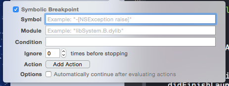
比普通断点多了两个属性Symbol和Module。

Symbol

Symbol的内容，可以有如下几种： 

1. 方法名称：会对所有具有此方法名称的类方法生效。例如 initWithFrame: 。 

2. 特定类的方法：OC类和C++类都适用，例如 ，[UIView initWithFrame:]或者 Shap::draw()。 

3. 函数名称。例如普通C函数。

通过设置Symbol来调试，好用根本停不下来，想怎么断点就怎么断点。

Test Failure Breakpoint

这个类型的断点会在test assertion 失败的时候暂停程序的执行。
